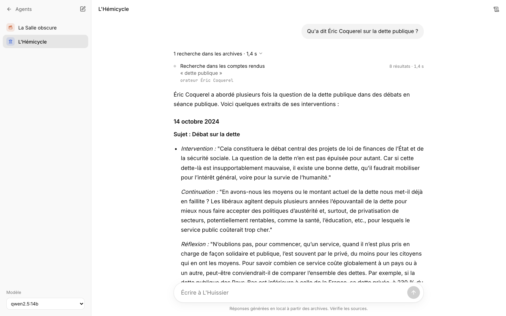
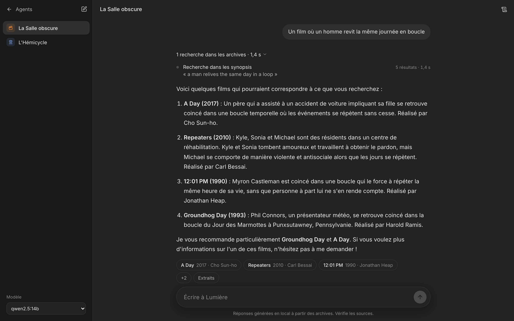

# Agora

[](https://github.com/rayaneferr/agora-rag/actions/workflows/ci.yml)
[](LICENSE)
[](https://huggingface.co/datasets/rferrat/agora-rag-index)
[](https://modelcontextprotocol.io)

> *Semantic RAG over French National Assembly debates and film synopses, exposed as MCP servers for Claude.
> Runs locally with bge-m3 and LanceDB. No API key.*

**La place où l'on vient chercher.** Agora met deux corpus à la disposition de **Claude** à travers des serveurs
**MCP** : les comptes rendus des séances de l'Assemblée nationale et 35 000 synopsis de films. Chaque serveur fait
de la recherche **sémantique** (embeddings bge-m3, index LanceDB) et renvoie des extraits sourcés : orateur, date
et lien de la séance, ou fiche Wikipédia du film. Claude décide quand chercher, avec quels filtres, et rédige la
réponse à partir de ces extraits.

Les serveurs tournent **en local** : on clone le dépôt, on télécharge l'index, et on les branche sur Claude.
Pas de clé API à fournir, pas de modèle à installer : c'est l'assistant de l'utilisateur qui raisonne.

| Contexte | Archives | Outils | Prompts |
|---|---|---|---|
| **L'Hémicycle** | 601 séances de l'Assemblée nationale (17e législature, juillet 2024 → juillet 2026) | `find_orateurs`, `search_debats`, `get_contexte` | `position-orateur`, `debat-sur-un-sujet`, `qui-a-repondu` |
| **La Salle obscure** | ~35 000 synopsis de films (Wikipédia), sortis de 1901 à 2017 | `search_films`, `get_film` | `trouver-un-film`, `recommander-des-films`, `fiche-film` |

Le dépôt contient aussi une [application locale](#application-locale-optionnelle) (interface React + modèle Ollama)
pour ceux qui veulent tout faire tourner hors ligne, sans Claude.

## Tester avec Claude

Prérequis : [uv](https://docs.astral.sh/uv/), [Claude Code](https://docs.claude.com/en/docs/claude-code) ou
Claude Desktop, et environ 4 Go de disque (index ~890 Mo, modèle d'embeddings ~2,3 Go, environnement Python).

```bash
git clone https://github.com/rayaneferr/agora-rag.git && cd agora-rag
uv sync
uv run agora-index import        # index + bge-m3 depuis Hugging Face, empreintes vérifiées (une seule fois)

claude mcp add -s user agora-assemblee -- uv --directory "$PWD" run mcp-assemblee
claude mcp add -s user agora-cinema -- uv --directory "$PWD" run mcp-cinema
```

`-s user` rend les serveurs disponibles dans tous les projets ; sans lui, ils ne le sont que dans ce dossier.
Claude Code lance chaque serveur lui-même (transport stdio) quand il en a besoin : rien à démarrer à la main.
Au premier appel, le chargement de bge-m3 prend quelques secondes ; ensuite, une recherche prend 0,1 à 0,3 s
(M4 Pro).

Ensuite, on pose simplement la question :

- *« Qu'a dit Éric Coquerel sur la dette publique ? »*
- *« Comment les députés ont-ils débattu de l'intelligence artificielle ? »*
- *« Un film où un voleur s'introduit dans les rêves des gens »*

Les **prompts** sont des parcours prêts à l'emploi, qui fixent la marche à suivre (quels outils, dans quel ordre)
et les règles de sourçage. Dans Claude Code, ils apparaissent comme des commandes :
`/mcp__agora-assemblee__position-orateur`, `/mcp__agora-cinema__trouver-un-film`… Les **resources**
`assemblee://archives` et `cinema://archives` décrivent l'étendue réelle de chaque base.


<details>
<summary>Claude Desktop</summary>

Dans `claude_desktop_config.json` (Réglages → Développeur → Modifier la configuration), avec des chemins
**absolus** : une application lancée depuis le Dock n'hérite pas du `PATH` du terminal (`which uv` donne le bon).

```json
{
  "mcpServers": {
    "agora-assemblee": {
      "command": "/opt/homebrew/bin/uv",
      "args": ["--directory", "/chemin/vers/agora-rag", "run", "mcp-assemblee"]
    },
    "agora-cinema": {
      "command": "/opt/homebrew/bin/uv",
      "args": ["--directory", "/chemin/vers/agora-rag", "run", "mcp-cinema"]
    }
  }
}
```

</details>

Tout autre client MCP (Cursor, l'[inspecteur MCP](https://github.com/modelcontextprotocol/inspector)…) se branche
de la même façon en stdio, ou en HTTP (voir [Serveurs MCP](#serveurs-mcp--stdio-ou-http)).

## Évolution du projet

Agora a changé trois fois de forme. Chaque étape répond à une limite de la précédente.

**v0.1 → v0.2 : des serveurs MCP et un client multi-fournisseurs.** Le point de départ : deux serveurs MCP de RAG
(Qdrant + bge-m3) et un agent en ligne de commande qui passait par LiteLLM, avec la clé API de l'utilisateur. Le
choix de MCP date de là : les outils de recherche sont séparés de l'agent qui les appelle, et testés à travers le
protocole plutôt qu'en appel Python direct.

**v0.3 : une application 100 % locale, sans clé.** Une interface React et un backend FastAPI sont venus s'ajouter,
d'abord avec un écran de saisie de clé OpenAI. Deux problèmes : demander une clé API est un frein (peu de gens en
ont une, et encore moins la confient à une application inconnue), et chaque question envoyait les extraits à un
tiers. La gestion de clé a été retirée au profit d'[Ollama](https://ollama.com) : gratuit, hors ligne, rien ne sort
de la machine. Le code a été restructuré au passage en **architecture hexagonale** par contextes, pour que le cœur
(la boucle agent) ignore quel modèle et quels outils il utilise.

**v0.4 : plus de Docker.** Qdrant est un serveur, donc une VM Linux sur Mac et Windows : c'était le prérequis le plus
lourd. L'index est passé sur LanceDB, embarqué comme SQLite (voir [plus bas](#pourquoi-lancedb-plutôt-quun-serveur-vectoriel)),
et publié sur Hugging Face. LiteLLM a ensuite été remplacé par un appel direct à l'API d'Ollama : une centaine de
paquets en moins.

**v0.5 : audit.** Index et modèle épinglés à une révision et vérifiés empreinte par empreinte, en-tête `Host` validé,
XML durci, actions de CI épinglées par SHA, Biome et Vitest sur le front.

**v0.6 : les serveurs MCP au premier plan.** L'application locale a un coût d'entrée élevé : Node, Ollama, et un
modèle de 9 Go qui doit savoir appeler des outils. Or la partie qui a de la valeur, c'est le **retrieval** : l'index,
les outils, les filtres, le sourçage. En branchant les serveurs MCP directement sur Claude, l'utilisateur garde son
assistant et son abonnement, et n'a plus besoin que de uv et de l'index. L'idée vient de
[Civis](https://github.com/mael-app/french-politics-mcp), un serveur MCP sur les programmes présidentiels de 2022
qui ne rédige rien lui-même et laisse la synthèse au client, à partir de citations vérifiables.

Pour que l'expérience guidée des agents survive au changement de client, chaque serveur expose désormais des
**prompts** (la marche à suivre et les règles de sourçage, qu'on ne peut plus imposer par un prompt système) et une
**resource** qui décrit l'étendue réelle de ses archives.

**L'hébergement public : prêt, mais pas en ligne.** L'étape suivante naturelle était de faire comme Civis : un
serveur public, branché en une commande sans rien installer. Tout est prêt : une app qui monte les serveurs de tous
les contextes sur un seul port, avec les garde-fous d'une exposition sans authentification, une image Docker et un
script de déploiement vers un Space Hugging Face, vérifiés de bout en bout en local avec l'index réel. Mais Civis
tient sur l'offre gratuite de Cloudflare Workers parce qu'il fait de la recherche lexicale (FTS5) ; la recherche
sémantique d'Agora demande de garder bge-m3 en mémoire, soit 3 à 4 Go de RAM : bien au-delà des offres gratuites
courantes (512 Mo), et les Spaces Docker de Hugging Face demandent désormais un abonnement. Les alternatives
gratuites imposent une mise en veille (30 à 60 s d'attente au réveil) ou l'administration d'une VM. Le projet reste
donc local pour l'instant,
et le déploiement tient en une commande le jour où il sera utile (voir [Déploiement](#déploiement)).

## Architecture hexagonale

```
                 adaptateurs entrants                    adaptateurs sortants
            ┌──────────────────────────┐          ┌──────────────────────────────────┐
navigateur ─┤ api.py (FastAPI, SSE)    │          │ llm.py      Ollama (API native)  │─> Ollama
terminal ───┤ cli.py                   │          │ mcp.py      passerelle MCP       │─> serveur MCP du contexte
client MCP ─┤ mcp_public.py (HTTP)     │          │ mcp_serve   stdio/HTTP, prompts  │
            └────────────┬─────────────┘          │ vectorstore LanceDB + bge-m3     │─> data/lancedb/
                         ▼                        │ index_hub   index ↔ Hugging Face │─> dataset épinglé
                ┌─────────────────────────────────┴───────────────────────────────────┐
                │ core/   agent.py (boucle agent, événements)                         │
                │         ports.py (LLMPort, ToolGateway)                             │
                │         context.py (ContextSpec, étendue des archives) · text.py    │
                └─────────────────────────────────────────────────────────────────────┘
contexts/cinema/     __init__ (identité, prompt, sources) · server.py (outils, prompts, resource MCP) · ingestion.py
contexts/assemblee/  idem

Claude Code / Desktop ──stdio──> contexts/<nom>/server.py        (usage principal : pas d'agent Agora, pas d'Ollama)
```

- **Le cœur ne dépend de rien** : il reçoit un modèle (`LLMPort`) et des outils (`ToolGateway`) par ses
  ports. Un test (`tests/test_architecture.py`) échoue si le cœur importe un adaptateur ou un contexte.
- **Un contexte = un dossier** : identité (lieu, guide, thème), prompt système, serveur MCP (outils, prompts,
  resource), ingestion, et la façon de transformer les résultats d'outils en sources citables. Ajouter un domaine
  (sport, droit…) revient à créer `contexts/<nom>/` et à l'inscrire dans `contexts/__init__.py` : il est alors
  exposé par l'application, par `agora-mcp-public` et par sa propre commande stdio.
- **Les serveurs MCP sont autonomes** : Claude s'y connecte directement, l'application locale passe par une
  passerelle MCP par contexte. Chaque agent ne voit que ses outils.
- **Ollama est appelé directement** (`/api/chat`, streaming, appels d'outils natifs) : pas de SDK
  intermédiaire, une centaine de paquets en moins.

## Application locale (optionnelle)

Une interface pour interroger les deux corpus sans Claude, avec un modèle local : tout reste sur la machine.
Prérequis supplémentaires : Node, et [Ollama](https://ollama.com/download) avec un modèle qui sait appeler des
outils (`ollama pull qwen2.5:14b` recommandé, environ 10 Go de RAM ; `qwen2.5:7b` si la machine est plus modeste).



```bash
uv sync
(cd web && npm install && npm run build)
uv run agora                                           # ouvre http://127.0.0.1:8765
```

Au premier lancement, l'application télécharge l'index et bge-m3 si `agora-index import` n'a pas été lancé,
**en affichant la progression dans l'interface** ; la saisie s'ouvre quand tout est prêt. Ensuite, tout fonctionne
hors ligne : seul Ollama (`localhost:11434`) est appelé.

Parcours : **l'Agora** (choix du modèle local) → **le Forum** (choix du guide : Lumière pour les films,
L'Huissier pour les débats) → **la salle** du contexte, qui prend l'identité visuelle de son lieu. L'interface
montre en direct les appels d'outils, le journal technique et la latence.

- **Mode démo** : `AGORA_DEMO=1 uv run agora` ajoute un faux modèle instantané qui appelle vraiment les outils.
- **Front en développement** : `uv run agora --dev` + `cd web && npm run dev` (Vite, rechargement à chaud).
- **Terminal** : `uv run agora-chat cinema` ou `uv run agora-chat assemblee --model qwen2.5:7b`.



### L'index

```bash
uv run agora-index import                              # index + bge-m3, avec vérification des empreintes
uv run agora-index verify                              # compare data/lancedb/ à la révision épinglée
uv run python -m agora.contexts.cinema.ingestion       # reconstruction (~2 h sur un M4 Pro) ; --limit 500 pour tester
uv run python -m agora.contexts.assemblee.ingestion    # --limit-seances 20 pour tester vite
```

Ni Docker, ni VM, ni base à lancer : l'index est un dossier (`data/lancedb/`, ou `$AGORA_HOME/lancedb`)
ouvert directement par les serveurs.

## Pourquoi LanceDB plutôt qu'un serveur vectoriel

La première version stockait l'index dans Qdrant. C'est une très bonne base, mais c'est un **serveur** : sur Mac
et Windows, il tourne dans Docker, donc dans une machine virtuelle Linux. Pour une application personnelle qui
doit s'installer par `git clone` + `uv sync`, c'était le prérequis le plus lourd.

LanceDB est **embarqué**, comme SQLite : une bibliothèque Python qui lit un dossier de fichiers (format colonnaire
Lance). Conséquences mesurées sur ce corpus (187 000 chunks, 1024 dimensions, M4 Pro) :

| | Qdrant 1.19 (Docker) | LanceDB 0.39 (embarqué) |
|---|---|---|
| Prérequis | Docker + VM | aucun (`uv sync`) |
| Index distribué | snapshots, 1,19 Go, à restaurer | dossiers, 0,87 Go, ouverts tels quels |
| Recherche films (sans filtre) | HNSW approché | exacte, ~50 ms |
| Recherche filtrée (orateur, genre, dates) | filtre pendant le parcours | pré-filtre SQL, 60 à 250 ms |

La recherche est exhaustive (pas d'index ANN) : à cette taille elle reste sous le quart de seconde et ne manque
aucun voisin. Comparé à Qdrant sur quatre requêtes, le top 5 est identique partout ; sur le top 20 des films,
l'index HNSW de Qdrant ne retrouvait que 16 à 17 des 20 vrais plus proches voisins, contre 20/20 ici. Les filtres
que le modèle passe aux outils sont échappés avant d'entrer dans la clause SQL (`tests/test_servers.py`).

## Sécurité et intégrité

Une application locale qui télécharge des fichiers et ouvre un port mérite quelques garde-fous :

- **Index et modèle épinglés.** Le code fixe un commit du dataset Hugging Face et un commit de bge-m3. Chaque
  fichier téléchargé est comparé aux empreintes publiées par le Hub pour ce commit (sha256 des fichiers LFS,
  sha1 git des autres) ; un fichier remplacé ou tronqué est refusé. Les poids PyTorch étant du pickle, seule la
  révision validée est chargée.
- **Boucle locale seulement.** L'API écoute sur 127.0.0.1 et refuse toute requête dont l'en-tête `Host` ne la
  désigne pas (protection contre le DNS rebinding : un site tiers ne peut pas piloter l'agent). Les serveurs MCP
  en HTTP refusent une adresse d'écoute non locale sans `--allow-remote`, car ils n'ont pas d'authentification.
- **Exposition publique encadrée.** `agora-mcp-public` ajoute ses propres garde-fous : hôtes et origines autorisés,
  taille des requêtes, débit par IP, aucune question ni IP journalisée (voir [Déploiement](#déploiement)).
- **Données externes traitées comme telles.** Le XML de l'Assemblée est parsé sans résolution d'entités ni accès
  réseau ; les filtres SQL sont échappés ; le Markdown du modèle est rendu sans HTML brut.
- **Chaîne d'intégration.** Actions GitHub épinglées par SHA, jeton en lecture seule, Dependabot sur les trois
  écosystèmes (uv, npm, actions), audits `pip-audit` et `npm audit` propres à la date de publication.

## Serveurs MCP : stdio ou HTTP

Chaque contexte a sa commande, en stdio par défaut (lancée par le client, comme ci-dessus) ou en service HTTP
autonome (Streamable HTTP, sans état) :

```bash
uv run mcp-cinema --transport http       # http://127.0.0.1:8101/mcp
uv run mcp-assemblee --transport http    # http://127.0.0.1:8102/mcp
uv run agora-chat cinema --mcp-url http://127.0.0.1:8101/mcp
```

`agora-mcp-public` sert **tous les contextes sur un seul port**, dans un seul processus (bge-m3 chargé une fois) :

```bash
uv run agora-mcp-public                  # http://127.0.0.1:8100/cinema/mcp, /assemblee/mcp, /health
claude mcp add --transport http agora-cinema http://127.0.0.1:8100/cinema/mcp
```

`/health` décrit chaque contexte (étendue, volume indexé) et répond 503 tant que l'index manque ou que bge-m3 se
charge : la sonde dit la vérité sur la capacité à répondre vite.

### Déploiement

Prêt, mais pas en ligne (voir [Évolution du projet](#évolution-du-projet)). Ce qui existe :

- **`Dockerfile`** : images de base épinglées par empreinte, dépendances verrouillées (torch CPU), index et bge-m3
  téléchargés et vérifiés **à la construction**, plus aucun accès au Hub à l'exécution. Lance `agora-mcp-public`.
- **`scripts/deploy_space.py`** : pousse vers un Space Hugging Face (`sdk: docker`) uniquement ce dont l'image a
  besoin, en un commit qui référence celui du dépôt ; refuse un arbre non commité.
- **`scripts/smoke_test.py <url>`** : vérifie un déploiement à travers le protocole MCP en HTTP (outils, recherche
  réelle et sa latence, prompt, resource), après avoir attendu le chargement du modèle.

Exposé sans authentification, le service s'appuie sur des garde-fous, configurables dans `.env.example` : hôtes et
origines autorisés, corps de requête limité à 64 Ko, limite de débit par IP (lue derrière N proxys de confiance),
écoute non locale seulement avec `--allow-remote`, journal d'accès coupé.

## Données

| Contexte | Source | Unité indexée |
|---|---|---|
| Cinéma | [Wikipedia Movie Plots](https://huggingface.co/datasets/vishnupriyavr/wiki-movie-plots-with-summaries) | chunk de synopsis (~1500 car.), préfixé titre/année/genre/réalisateur |
| Assemblée | [data.assemblee-nationale.fr](https://data.assemblee-nationale.fr/travaux-parlementaires/debats) (XML Syceron) | une intervention (paragraphes consécutifs d'un même orateur sous un même point), préfixée orateur/date/sujet |

Embeddings locaux `BAAI/bge-m3` (multilingue, 1024 dim). L'index prêt à l'emploi (tables LanceDB +
manifeste avec empreintes) est publié sur Hugging Face : [rferrat/agora-rag-index](https://huggingface.co/datasets/rferrat/agora-rag-index).
Synopsis issus de Wikipédia (CC BY-SA) ; comptes rendus de l'Assemblée nationale sous
[Licence Ouverte](https://data.assemblee-nationale.fr/licence-ouverte-open-licence).

## Développement

```bash
uv run pytest                                     # architecture, parseur, outils/prompts/resources MCP, app publique, API
uv run ruff check . && uv run ruff format --check .
(cd web && npm run lint && npm test)              # Biome (lint + format) et Vitest (état de conversation, parseur SSE)
uv run python scripts/smoke_test.py               # contre agora-mcp-public lancé en local, avec l'index réel
```

Les tests n'ont besoin ni de bge-m3, ni d'Ollama, ni de l'index : les outils, prompts et resources sont appelés à
travers un client MCP (en mémoire, ou en HTTP pour l'app publique), sur une base LanceDB temporaire, avec un
embedder factice et le modèle de démo.

## Feuille de route

- [x] **v0.1.0** — CLI + 2 serveurs MCP (RAG cinéma et Assemblée nationale)
- [x] **v0.2** — tests, lint, CI, serveurs MCP en HTTP, ingestion complète + export d'index
- [x] **v0.3** — application locale : architecture hexagonale par contextes, Ollama, sans clé API
- [x] **v0.4** — installation sans Docker : index embarqué (LanceDB) publié sur Hugging Face, 100 % hors ligne
- [x] **v0.5.0** — interface épurée : recherches MCP repliables, sources compactes, thème clair/sombre
- [x] **v0.5.1** — audit : index épinglé et vérifié, Host validé, premier lancement visible, Ollama natif, Biome + Vitest
- [x] **v0.6.0** — serveurs MCP pour Claude : prompts guidés et resources d'archives, app multi-contextes sur un seul
  port avec garde-fous d'exposition, image Docker et smoke test (déploiement prêt, non actif)
- [ ] **v0.7.0** — benchmark du retrieval : dense vs hybride (BM25 + dense), reranking, exactitude des citations,
  latence. Exemple à corriger : « a man relives the same day over and over » ne remonte pas *Groundhog Day* dans
  le top 5 (des films de boucle temporelle, mais pas le plus attendu)
- [ ] **v0.8.0** — installation en une commande (`uvx`, données dans `~/.cache`), historique des conversations
- [ ] **v0.9.0** — groupes politiques, mise à jour incrémentale des séances, nouveaux contextes
- [ ] Hébergement public des serveurs MCP, quand un hébergeur adapté (≥ 4 Go de RAM, sans mise en veille) sera retenu

## Licence

Code sous licence [MIT](LICENSE). Merci à [Civis](https://github.com/mael-app/french-politics-mcp) pour l'idée d'un
serveur MCP qui cite plutôt qu'il ne résume.
