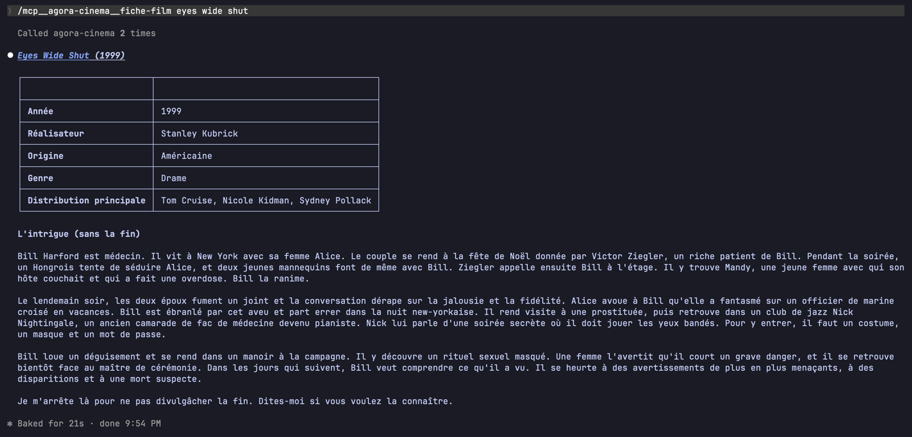

# Agora

[](https://github.com/rayaneferr/agora-rag/actions/workflows/ci.yml)
[](LICENSE)
[](#les-données)
[](https://huggingface.co/datasets/rferrat/agora-rag-index)
[](https://modelcontextprotocol.io)

> *Semantic RAG over French National Assembly debates and film synopses, exposed as MCP servers for Claude.
> Runs locally with bge-m3 and LanceDB. No API key.*

**La place où l'on vient chercher.** Agora met deux corpus à la disposition de **Claude** à travers des serveurs
**MCP** : les comptes rendus des séances de l'Assemblée nationale et 35 000 synopsis de films. Chaque serveur fait
de la recherche **sémantique** (embeddings bge-m3, index LanceDB) et renvoie des extraits sourcés : orateur, date
et lien de la séance, ou fiche Wikipédia du film. Claude décide quand chercher, avec quels filtres, et rédige la
réponse à partir de ces extraits.

Les serveurs tournent **en local** : on clone le dépôt, on télécharge l'index, et on les branche sur Claude.
Pas de clé API, pas de modèle de langage à installer : c'est l'assistant de l'utilisateur qui raisonne, Agora ne
fait que chercher.

| Contexte | Archives | Outils | Prompts |
|---|---|---|---|
| **L'Hémicycle** | 601 séances de l'Assemblée nationale (17e législature, juillet 2024 → juillet 2026) | `find_orateurs`, `search_debats`, `get_contexte` | `position-orateur`, `debat-sur-un-sujet`, `qui-a-repondu` |
| **La Salle obscure** | ~35 000 synopsis de films (Wikipédia), sortis de 1901 à 2017 | `search_films`, `get_film` | `trouver-un-film`, `recommander-des-films`, `fiche-film` |

## Tester avec Claude

Prérequis : [uv](https://docs.astral.sh/uv/), [Claude Code](https://docs.claude.com/en/docs/claude-code) ou
Claude Desktop, et environ 4 Go de disque (index ~890 Mo, modèle d'embeddings ~2,3 Go, environnement Python).

```bash
git clone https://github.com/rayaneferr/agora-rag.git && cd agora-rag
uv sync
uv run agora-index import        # index + bge-m3 depuis Hugging Face, empreintes vérifiées (une seule fois)

claude mcp add -s user agora-assemblee -- uv --directory "$PWD" run mcp-assemblee
claude mcp add -s user agora-cinema -- uv --directory "$PWD" run mcp-cinema
```

`-s user` rend les serveurs disponibles dans tous les projets ; sans lui, ils ne le sont que dans ce dossier.
Claude Code lance chaque serveur lui-même (transport stdio) quand il en a besoin : rien à démarrer à la main.
Au premier appel, le chargement de bge-m3 prend quelques secondes ; ensuite, une recherche prend 0,1 à 0,3 s
(M4 Pro).

Ensuite, on pose simplement la question :

- *« Qu'a dit Éric Coquerel sur la dette publique ? »*
- *« Comment les députés ont-ils débattu de l'intelligence artificielle ? »*
- *« Un film où un voleur s'introduit dans les rêves des gens »*

Les **prompts** sont des parcours prêts à l'emploi, qui fixent la marche à suivre (quels outils, dans quel ordre)
et les règles de sourçage. Dans Claude Code, ils apparaissent comme des commandes :
`/mcp__agora-assemblee__position-orateur`, `/mcp__agora-cinema__trouver-un-film`… Les **resources**
`assemblee://archives` et `cinema://archives` décrivent chaque base : étendue réelle, volume indexé, provenance
et licence des données.



<details>
<summary>Claude Desktop</summary>

Dans `claude_desktop_config.json` (Réglages → Développeur → Modifier la configuration), avec des chemins
**absolus** : une application lancée depuis le Dock n'hérite pas du `PATH` du terminal (`which uv` donne le bon).

```json
{
  "mcpServers": {
    "agora-assemblee": {
      "command": "/opt/homebrew/bin/uv",
      "args": ["--directory", "/chemin/vers/agora-rag", "run", "mcp-assemblee"]
    },
    "agora-cinema": {
      "command": "/opt/homebrew/bin/uv",
      "args": ["--directory", "/chemin/vers/agora-rag", "run", "mcp-cinema"]
    }
  }
}
```

</details>

Tout autre client MCP (Cursor, l'[inspecteur MCP](https://github.com/modelcontextprotocol/inspector)…) se branche
de la même façon en stdio, ou en HTTP (voir [Serveurs MCP](#serveurs-mcp--stdio-ou-http)).

## Les données

Agora ne produit aucun texte : il indexe deux corpus publics et renvoie leurs extraits avec un lien vers le
document d'origine. Les deux sont réutilisés dans le respect de leur licence, et l'index qui en est tiré
(publié sur [Hugging Face](https://huggingface.co/datasets/rferrat/agora-rag-index)) reste sous ces mêmes
licences. Le code, lui, est sous licence MIT. Le détail des attributions est dans [NOTICE.md](NOTICE.md).

### L'Hémicycle : les débats de l'Assemblée nationale

**Ce que c'est.** Les comptes rendus intégraux des séances publiques de l'Assemblée nationale pour la
17e législature : 601 séances, du 18 juillet 2024 au 21 juillet 2026. Ce sont les textes officiels de ce qui a été
dit dans l'hémicycle, par les députés comme par les ministres, établis par les services de l'Assemblée.

**D'où ils viennent.** De la plateforme open data de l'Assemblée,
[data.assemblee-nationale.fr](https://data.assemblee-nationale.fr/travaux-parlementaires/debats), qui les publie
au format XML Syceron (une archive `syseron.xml.zip` pour la législature). Chaque extrait renvoyé par Agora pointe
vers le compte rendu de la séance sur [assemblee-nationale.fr](https://www.assemblee-nationale.fr).

**Comment ils sont traités.** L'ingestion (`contexts/assemblee/ingestion.py`) reconstitue les **interventions** :
les paragraphes consécutifs d'un même orateur sous un même point de l'ordre du jour. Les interjections
(« Très bien ! ») sont écartées quand elles interrompent un autre orateur, les noms sont normalisés
(« M. Éric Coquerel (LFI-NFP) » et « Éric Coquerel » deviennent un seul orateur, avec sa civilité et son groupe
quand le compte rendu l'indique), et chaque sujet garde son contexte (texte débattu › article). Les interventions
longues sont découpées en chunks préfixés par l'orateur, la date et le sujet, puis encodées : 110 118 extraits au
total. Le texte des interventions n'est pas réécrit.

**Licence.** [Licence Ouverte / Open Licence](https://data.assemblee-nationale.fr/licence-ouverte-open-licence)
d'Etalab, dans la version d'octobre 2011 publiée par l'Assemblée. Elle autorise la reproduction, la
redistribution et l'adaptation, y compris commerciales, **à condition de mentionner la source** (a minima
« Assemblée nationale ») **et la date de dernière mise à jour** des données. Agora s'y conforme ici, dans la carte
de l'index, et dans les réponses elles-mêmes : chaque extrait porte la date de la séance et le lien vers le compte
rendu, et la resource `assemblee://archives` indique le producteur, la licence et l'étendue exacte des séances.

### La Salle obscure : les synopsis de films

**Ce que c'est.** Les résumés d'intrigue (sections « Plot ») de 34 886 articles de films de Wikipédia en anglais,
du cinéma muet de 1901 aux sorties de 2017, avec l'année, le titre, l'origine, le réalisateur, la distribution
et le genre. Environ 270 films y figurent deux fois (sous deux origines) : la recherche les fusionne pour ne
renvoyer chaque film qu'une fois.

**D'où ils viennent.** Le texte est écrit par les contributeurs de [Wikipédia](https://en.wikipedia.org/). Il a
été collecté en 2018 dans le dataset Kaggle [Wikipedia Movie Plots](https://www.kaggle.com/datasets/jrobischon/wikipedia-movie-plots)
(JustinR), repris en 2021 dans [Wikipedia Movie Plots with AI Plot Summaries](https://www.kaggle.com/datasets/gabrieltardochi/wikipedia-movie-plots-with-plot-summaries)
(Gabriel Tardochi), qui ajoute un résumé court de chaque intrigue, puis publié sur Hugging Face
([vishnupriyavr/wiki-movie-plots-with-summaries](https://huggingface.co/datasets/vishnupriyavr/wiki-movie-plots-with-summaries)),
d'où Agora le télécharge. Chaque film renvoyé pointe vers son article Wikipédia.

**Comment ils sont traités.** L'ingestion (`contexts/cinema/ingestion.py`) vide les métadonnées inconnues
(« unknown »), découpe les synopsis en chunks d'environ 1 500 caractères (avec recouvrement) préfixés par le titre,
l'année, le genre et le réalisateur, puis les encode : 77 060 extraits. Le texte des synopsis n'est pas réécrit. Les résumés courts (`summary`) ont été
**générés par un modèle** ([DistilBART-CNN-12-6](https://huggingface.co/sshleifer/distilbart-cnn-12-6)) dans le
dataset source : ils peuvent contenir des erreurs, et la référence reste le synopsis intégral (`get_film`).

**Licence.** [CC BY-SA 4.0](https://creativecommons.org/licenses/by-sa/4.0/), celle des textes de Wikipédia et du
dataset source. Elle impose de **citer les auteurs** (Wikipédia et ses contributeurs), d'**indiquer la licence**
et de **partager les adaptations dans les mêmes conditions** : la table `films` de l'index, qui est une
adaptation, est donc elle aussi sous CC BY-SA 4.0. Chaque film renvoyé porte le lien de son article, et la
resource `cinema://archives` rappelle l'origine et la licence.

### Limites à connaître

- **Des archives datées.** Les débats s'arrêtent au 21 juillet 2026, les films à 2017. Les prompts le rappellent
  au modèle, pour qu'il ne conclue pas au silence sur une période que la base ne couvre pas.
- **Des synopsis en anglais.** bge-m3 est multilingue, mais une requête en anglais retrouve mieux les films ; les
  prompts le demandent au modèle.
- **Un retrieval perfectible.** La recherche est purement dense : « a man relives the same day over and over »
  remonte des films de boucle temporelle, mais pas *Groundhog Day* dans le top 5. C'est l'objet du prochain
  chantier (voir la [feuille de route](#feuille-de-route)).
- **Des personnes publiques.** Les comptes rendus nomment des députés et des ministres dans l'exercice de leur
  mandat, lors de séances publiques par nature. Les prompts demandent de rapporter leurs propos sans les juger ni
  les attribuer à tort.

## Architecture

```
Claude Code / Desktop ──stdio──> contexts/<nom>/server.py          outils, prompts et resource MCP d'un contexte
client HTTP ───────────────────> adapters/inbound/mcp_public.py    tous les contextes sur un port (/<nom>/mcp)
                                          │
                                          ▼
                        adapters/outbound/mcp_serve.py      lancement stdio/HTTP, resource archives, prompts guidés
                        adapters/outbound/vectorstore.py    LanceDB + bge-m3        ─> data/lancedb/
                        adapters/outbound/index_hub.py      index ↔ Hugging Face    ─> dataset épinglé et vérifié
                                          │
                                          ▼
                        core/   context.py (ContextSpec : description, provenance, étendue) · text.py (découpage)
```

- **Un contexte = un dossier** (`contexts/<nom>/`) : sa description et la provenance de ses données
  (`__init__.py`), son serveur MCP (`server.py`) et son ingestion. Ajouter un domaine (sport, droit…) revient à
  créer ce dossier et à l'inscrire dans `contexts/__init__.py` : il est alors exposé en stdio et par
  `agora-mcp-public`.
- **Le cœur ne dépend de rien** : `core/` n'importe que la bibliothèque standard, et un contexte n'importe jamais
  un autre contexte. Deux tests (`tests/test_architecture.py`) y veillent.
- **Les serveurs ne rédigent rien** : ils cherchent et renvoient des extraits avec leurs métadonnées ; la
  synthèse revient au client, guidée par les prompts.

## Évolution du projet

Agora a changé plusieurs fois de forme. Chaque étape répond à une limite de la précédente.

**v0.1 → v0.2 : des serveurs MCP et un agent.** Le point de départ : deux serveurs MCP de RAG (Qdrant + bge-m3) et
un agent en ligne de commande qui passait par LiteLLM, avec la clé API de l'utilisateur. Le choix de MCP date de
là : les outils de recherche sont séparés de l'agent qui les appelle, et testés à travers le protocole plutôt qu'en
appel Python direct.

**v0.3 : une application 100 % locale.** Une interface React et un backend FastAPI se sont ajoutés, d'abord avec
un écran de saisie de clé OpenAI. Demander une clé API est un frein, et chaque question envoyait les extraits à un
tiers : la gestion de clé a été remplacée par un modèle local via [Ollama](https://ollama.com). Le code a été
restructuré au passage en architecture hexagonale par contextes.

**v0.4 : plus de Docker.** Qdrant est un serveur, donc une VM Linux sur Mac et Windows : c'était le prérequis le plus
lourd. L'index est passé sur LanceDB, embarqué comme SQLite (voir [plus bas](#pourquoi-lancedb)), et publié sur
Hugging Face.

**v0.5 : audit.** Index et modèle épinglés à une révision et vérifiés empreinte par empreinte, en-têtes HTTP
validés, XML durci, actions de CI épinglées par SHA.

**v0.6 : les serveurs MCP branchés sur Claude.** L'application locale avait un coût d'entrée élevé : Node,
Ollama, et un modèle de 9 Go capable d'appeler des outils. Or ce qui a de la valeur, c'est le **retrieval** :
l'index, les outils, les filtres, le sourçage. Branchés directement sur Claude, les serveurs laissent l'utilisateur
garder son assistant et son abonnement ; il ne lui faut plus que uv et l'index. Pour que l'expérience guidée
survive au changement de client, chaque serveur expose des **prompts** (la marche à suivre et les règles de
sourçage, qu'on ne peut plus imposer par un prompt système) et une **resource** qui décrit ses archives.

**v0.7 : recentrage.** L'application locale (interface, agent Ollama) et le déploiement vers un Space Hugging Face
ont été retirés : ils répondaient à un usage que les serveurs MCP couvrent désormais, et un dépôt plus petit se lit
et se maintient mieux. Ils restent consultables au tag [`v0.6.0`](https://github.com/rayaneferr/agora-rag/tree/v0.6.0).
Le serveur HTTP multi-contextes et ses garde-fous sont conservés : ils servent aux clients qui ne parlent pas
stdio, et constituent la base d'un futur hébergement. Celui-ci attend un hébergeur adapté : la recherche sémantique
garde bge-m3 en mémoire (3 à 4 Go de RAM), au-delà des offres gratuites courantes, et les Spaces Docker de Hugging
Face sont désormais payants. La provenance et les licences des données sont maintenant documentées et exposées par
les serveurs eux-mêmes.

### Pourquoi LanceDB

La première version stockait l'index dans Qdrant. C'est une très bonne base, mais c'est un **serveur** : sur Mac et
Windows, il tourne dans Docker, donc dans une machine virtuelle Linux. LanceDB est **embarqué**, comme SQLite : une
bibliothèque Python qui lit un dossier de fichiers (format colonnaire Lance). Mesures sur ce corpus (187 000 chunks,
1024 dimensions, M4 Pro) :

| | Qdrant 1.19 (Docker) | LanceDB 0.39 (embarqué) |
|---|---|---|
| Prérequis | Docker + VM | aucun (`uv sync`) |
| Index distribué | snapshots, 1,19 Go, à restaurer | dossiers, 0,87 Go, ouverts tels quels |
| Recherche films (sans filtre) | HNSW approché | exacte, ~50 ms |
| Recherche filtrée (orateur, genre, dates) | filtre pendant le parcours | pré-filtre SQL, 60 à 250 ms |

La recherche est exhaustive (pas d'index ANN) : à cette taille, elle reste sous le quart de seconde et ne manque
aucun voisin. Sur le top 20 des films, l'index HNSW de Qdrant ne retrouvait que 16 à 17 des 20 vrais plus proches
voisins, contre 20/20 ici.

## Sécurité et intégrité

- **Index et modèle épinglés.** Le code fixe un commit du dataset Hugging Face et un commit de bge-m3. Chaque
  fichier téléchargé est comparé aux empreintes publiées par le Hub pour ce commit (sha256 des fichiers LFS,
  sha1 git des autres) ; un fichier remplacé ou tronqué est refusé. Les poids PyTorch étant du pickle, seule la
  révision validée est chargée.
- **Données externes traitées comme telles.** Le XML de l'Assemblée est parsé sans résolution d'entités ni accès
  réseau ; les filtres que le modèle passe aux outils sont échappés avant d'entrer dans la clause SQL
  (`tests/test_servers.py`).
- **Exposition réseau encadrée.** En HTTP, les serveurs refusent une adresse d'écoute non locale sans
  `--allow-remote`, car ils n'ont pas d'authentification. `agora-mcp-public` ajoute ses garde-fous : hôtes et
  origines autorisés, corps de requête limité à 64 Ko, débit par IP (lue derrière N proxys de confiance), aucune
  question ni IP journalisée.
- **Chaîne d'intégration.** Actions GitHub épinglées par SHA, jeton en lecture seule, Dependabot (uv et actions).

## Serveurs MCP : stdio ou HTTP

Chaque contexte a sa commande, en stdio par défaut (lancée par le client, comme ci-dessus) ou en service HTTP
autonome (Streamable HTTP, sans état) :

```bash
uv run mcp-cinema --transport http       # http://127.0.0.1:8101/mcp
uv run mcp-assemblee --transport http    # http://127.0.0.1:8102/mcp
```

`agora-mcp-public` sert **tous les contextes sur un seul port**, dans un seul processus (bge-m3 chargé une fois) :

```bash
uv run agora-mcp-public                  # http://127.0.0.1:8100/cinema/mcp, /assemblee/mcp, /health
claude mcp add --transport http agora-cinema http://127.0.0.1:8100/cinema/mcp
uv run python scripts/smoke_test.py      # vérifie le service à travers le protocole MCP (index réel)
```

`/health` décrit chaque contexte (étendue, volume indexé) et répond 503 tant que l'index manque ou que bge-m3 se
charge. Les garde-fous se règlent dans `.env.example`.

## Développement

```bash
uv run agora-index import                             # index + bge-m3, avec vérification des empreintes
uv run agora-index verify                             # compare data/lancedb/ à la révision épinglée
uv run python -m agora.contexts.cinema.ingestion      # reconstruction (~2 h sur un M4 Pro) ; --limit 500 pour tester
uv run python -m agora.contexts.assemblee.ingestion   # --limit-seances 20 pour tester vite

uv run pytest                                         # architecture, parseur, outils, prompts, resources, HTTP
uv run ruff check . && uv run ruff format --check .
```

Les tests n'ont besoin ni de bge-m3 ni de l'index : les outils, prompts et resources sont appelés à travers un
client MCP (en mémoire, ou en HTTP pour `agora-mcp-public`), sur une base LanceDB temporaire, avec un embedder
factice. Le fichier de séance utilisé par les tests (`tests/fixtures/seance.xml`) est fictif.

## Feuille de route

- [x] **v0.1.0** — CLI + 2 serveurs MCP (RAG cinéma et Assemblée nationale)
- [x] **v0.2** — tests, lint, CI, serveurs MCP en HTTP, ingestion complète + export d'index
- [x] **v0.3** — application locale : architecture hexagonale par contextes, Ollama, sans clé API
- [x] **v0.4** — installation sans Docker : index embarqué (LanceDB) publié sur Hugging Face
- [x] **v0.5** — audit : index épinglé et vérifié, en-têtes validés, CI durcie
- [x] **v0.6.0** — serveurs MCP pour Claude : prompts guidés, resources d'archives, serveur HTTP multi-contextes
- [x] **v0.7.0** — recentrage MCP : application locale et déploiement Hugging Face retirés, provenance et licences
  des données documentées et exposées par les serveurs
- [ ] **v0.8.0** — benchmark du retrieval : dense vs hybride (BM25 + dense), reranking, exactitude des citations,
  latence ; point de départ : *Groundhog Day* absent du top 5
- [ ] **v0.9.0** — installation en une commande (`uvx`, données dans `~/.cache`), mise à jour incrémentale des
  séances, nouveaux contextes
- [ ] Hébergement public des serveurs MCP, quand un hébergeur adapté (≥ 4 Go de RAM, sans mise en veille) sera retenu

## Licence

Le **code** est sous licence [MIT](LICENSE). Les **données** ne le sont pas : les synopsis de films sont sous
[CC BY-SA 4.0](https://creativecommons.org/licenses/by-sa/4.0/) (Wikipédia et ses contributeurs), les comptes rendus
de l'Assemblée nationale sous [Licence Ouverte / Open Licence](https://data.assemblee-nationale.fr/licence-ouverte-open-licence),
et l'index publié sur Hugging Face suit ces deux licences, table par table. Voir [Les données](#les-données) et
[NOTICE.md](NOTICE.md).
